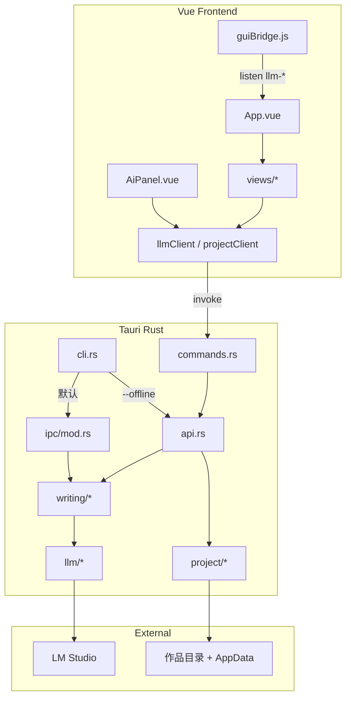

# Kk Novel Ai 项目分析文档

> 版本：`0.1.2`  
> 仓库路径：`D:\KKFiles\KKProjects\Kinit\kk_novel_ai`  
> 文档路径：[`docs/project-analysis.md`](project-analysis.md)  
> 配套文档：[`docs/todo.md`](todo.md)、[`docs/lmstudio.md`](lmstudio.md)

---

## 0. 本文 TODO（分析覆盖清单）

| # | 分析项 | 状态 | 主要代码路径 |
|---|---|---|---|
| A1 | 产品定位与整体架构 | 完成 | `src-tauri/src/lib.rs`, `src/App.vue` |
| A2 | 目录结构与技术栈 | 完成 | `package.json`, `src-tauri/Cargo.toml`, `src-tauri/tauri.conf.json` |
| A3 | 进程入口与双二进制 | 完成 | `src-tauri/src/main.rs`, `src-tauri/src/bin/kk_novel_cli.rs` |
| A4 | 后端模块职责 | 完成 | `src-tauri/src/**` |
| A5 | 写作流水线与 Prompt | 完成 | `writing/mod.rs`, `prompts/*`, `llm/mod.rs` |
| A6 | CLI / RPC / GUI IPC | 完成 | `cli.rs`, `ipc/mod.rs`, `guiBridge.js` |
| A7 | 前端视图与状态 | 完成 | `src/views/*`, `stores/appState.js`, `services/*` |
| A8 | 磁盘数据与配置 | 完成 | `project/mod.rs`, `paths.rs`, `settings.rs` |
| A9 | UI 主题体系 | 完成 | `src/style.css`, `src/App.vue`, `index.html` |
| A10 | 构建发布与已知缺口 | 完成 | `build.py`, `docs/todo.md` |

---

## 1. 产品定位

**Kk Novel Ai** 是本地优先的桌面小说创作台：

- 作品以**本地目录**为真相源（`project.json` + `chapters/*.md` + lore/memory）
- 大模型走 **LM Studio** OpenAI 兼容接口（默认 `http://127.0.0.1:1234/v1`）
- 同时提供 **GUI**、**CLI**、**NDJSON RPC**，以及 **CLI → 运行中 GUI** 的本机 IPC

一句话：用本地模型写长篇连载时，管作品、章节、设定、续写润色与导出。

---

## 2. 整体架构



---

## 3. 目录结构（精简）

```text
kk_novel_ai/
├── docs/                      # 文档：todo / lmstudio / 本分析
├── src/                       # Vue 3 前端
│   ├── components/AiPanel.vue
│   ├── services/              # tauri / llm / project / guiBridge
│   ├── stores/appState.js
│   ├── views/                 # 作品/大纲/写作/设定/日志/设置
│   ├── App.vue
│   ├── style.css              # NapCat 风主题 Token
│   └── main.js
├── src-tauri/                 # Tauri 2 + Rust
│   ├── prompts/               # 写作 Prompt 模板
│   ├── src/
│   │   ├── main.rs            # GUI/CLI 分流
│   │   ├── bin/kk_novel_cli.rs
│   │   ├── lib.rs
│   │   ├── cli.rs / ipc/ / api.rs / commands.rs
│   │   ├── writing/ / project/ / llm/ / export/
│   │   └── ...
│   ├── Cargo.toml
│   └── tauri.conf.json
├── frontend-dist/             # 前端构建产物
├── outputs/                   # 本地测试作品样例
├── build.py                   # 打包脚本
├── package.json
└── vite.config.js
```

（忽略 `node_modules/`、`src-tauri/target/`、`.git/`）

---

## 4. 技术栈

| 层 | 选型 | 版本线索 |
|---|---|---|
| 桌面壳 | Tauri 2 | `Cargo.toml` `tauri = "2"`；`tauri.conf.json` |
| 前端 | Vue 3 + Vite 5 | [`package.json`](../package.json) |
| 后端 | Rust 2021 | [`src-tauri/Cargo.toml`](../src-tauri/Cargo.toml) |
| HTTP | reqwest + rustls | LM Studio 流式 chat |
| CLI | clap 4 | [`cli.rs`](../src-tauri/src/cli.rs) |
| 应用版本 | `0.1.2` | `package.json` / `Cargo.toml` / `tauri.conf.json` 同步 |

窗口：无系统边框（`decorations: false`），自定义标题栏见 [`App.vue`](../src/App.vue)。

---

## 5. 进程入口与双二进制

| 二进制 | 路径 | 行为 |
|---|---|---|
| `kk_novel_ai` | [`src-tauri/src/main.rs`](../src-tauri/src/main.rs) | 无参 → GUI；有子命令/`--cli` → CLI。Release 使用 `windows_subsystem = "windows"` |
| `kk_novel_cli` | [`src-tauri/src/bin/kk_novel_cli.rs`](../src-tauri/src/bin/kk_novel_cli.rs) | 纯控制台入口，stdout 更稳定，适合调试 |

GUI 装配：[`lib.rs`](../src-tauri/src/lib.rs) 注册 Tauri 命令、挂载 `CancelRegistry` / `PrepareRegistry`、setup 时启动 IPC。

前端入口：[`src/main.js`](../src/main.js) → [`App.vue`](../src/App.vue)；HTML：[`index.html`](../index.html)。

---

## 6. 后端模块一览

| 模块路径 | 职责 |
|---|---|
| [`api.rs`](../src-tauri/src/api.rs) | GUI/CLI 共用业务 API、`dispatch_rpc`、`writing_run_stream` |
| [`commands.rs`](../src-tauri/src/commands.rs) | `#[tauri::command]` 薄封装 |
| [`gui_writing.rs`](../src-tauri/src/gui_writing.rs) | 流式写作 + emit `llm-chunk/done/error` |
| [`cli.rs`](../src-tauri/src/cli.rs) | clap 子命令、默认 IPC、`--offline`、RPC 循环 |
| [`ipc/mod.rs`](../src-tauri/src/ipc/mod.rs) | loopback TCP NDJSON、`ipc.json` 发现 |
| [`llm/mod.rs`](../src-tauri/src/llm/mod.rs) | LM Studio 客户端 |
| [`llm/stream.rs`](../src-tauri/src/llm/stream.rs) | 流式取消注册表 |
| [`project/mod.rs`](../src-tauri/src/project/mod.rs) | 作品/章节/lore/memory 读写 |
| [`writing/mod.rs`](../src-tauri/src/writing/mod.rs) | 任务枚举、上下文组装、`run_writing` |
| [`writing/retrieve.rs`](../src-tauri/src/writing/retrieve.rs) | lore 关键词打分召回 |
| [`export/mod.rs`](../src-tauri/src/export/mod.rs) | TXT 导出 |
| [`genlog.rs`](../src-tauri/src/genlog.rs) | 生成日志 jsonl |
| [`settings.rs`](../src-tauri/src/settings.rs) / [`paths.rs`](../src-tauri/src/paths.rs) | 设置与 AppData 路径 |
| [`error.rs`](../src-tauri/src/error.rs) | 统一错误类型 |

Prompt 模板：[`src-tauri/prompts/`](../src-tauri/prompts/)  
`continue_chapter.md` / `polish.md` / `outline_expand.md` / `consistency_check.md` / `chapter_summary.md`

---

## 7. 写作流水线

### 7.1 请求模型

`WritingRequest`（[`writing/mod.rs`](../src-tauri/src/writing/mod.rs)）：

- `project_root`, `chapter_id`, `task`
- 可选：`instruction`, `selection`, `model`, `temperature`, `max_tokens`

任务：`continue` | `polish` | `outline` | `consistency` | `chapter_summary`（含别名）。

### 7.2 数据流

1. `assemble_messages`：读章、memory、lore 召回 → 渲染 Prompt → 按 `context_budget` 截断  
2. `LmStudioClient.chat_stream`：流式补全  
3. 结果去向：
   - **GUI**：预览区（`previewText`），用户点「插入章末 / 替换选区」才进编辑器；保存才落盘  
   - **CLI IPC**：驱动同一套预览；`--apply append|replace` 可写回章节  
   - **CLI `--offline` / RPC**：不驱动 GUI，文本返回 + genlog；可选本地 apply  
4. `chapter_summary`：额外写 memory snapshot + 更新 `project.json` 章纲

### 7.3 genlog

路径：`%APPDATA%/kk_novel_ai/gen_log.jsonl`（[`paths.rs`](../src-tauri/src/paths.rs)、[`genlog.rs`](../src-tauri/src/genlog.rs)）  
字段含 `source`：`gui` / `gui-ipc` / `cli-offline` / `cli-rpc` 等。

---

## 8. CLI / RPC / IPC

### 8.1 CLI（推荐调试用 `kk_novel_cli`）

文档：[`docs/lmstudio.md`](lmstudio.md)

```text
tools | ping | rpc
settings get|set|patch
llm health|models|chat
project create|open|get
chapter list|read|write|create|delete|update
lore list|upsert|delete
writing run <root> <chapter_id> <task>
  [--instruction] [--selection] [--model] [--stream-stderr]
  [--offline] [--apply none|append|replace]
export txt
gen-log
```

**默认** `writing run` 走 GUI IPC（界面需已启动）；无 GUI 时报错；旁路加 `--offline`。

### 8.2 RPC

`kk_novel_ai rpc`：stdin 每行 NDJSON → `dispatch_rpc`。  
注意：RPC 内 `writing_run` **不驱动 GUI**。

### 8.3 GUI IPC

- 发现：`%APPDATA%/kk_novel_ai/ipc.json`
- 命令：`ping` / `gui_status` / `writing_run` / `llm_cancel` / `preview_apply` / `project_focus`
- 前端桥：[`src/services/guiBridge.js`](../src/services/guiBridge.js)（`cli-writing-start`、`llm-*`、`chapter-external-update`）

---

## 9. 前端结构

| 类别 | 路径 | 说明 |
|---|---|---|
| 壳 | [`App.vue`](../src/App.vue) | Tauri 标题栏 + NapCat 式侧栏/主浮层；冲突弹窗 |
| 壳组件 | [`components/shell/AppSidebar.vue`](../src/components/shell/AppSidebar.vue)、[`PageHeader.vue`](../src/components/shell/PageHeader.vue)、[`PageBackground.vue`](../src/components/shell/PageBackground.vue) | 可折叠侧栏、sticky 胶囊头、装饰 blob |
| 主题 | [`style.css`](../src/style.css)、[`index.html`](../index.html) | 浅/深 Token（danger-50 粉壳 + content 白浮层）；系统中文 UI 字体 + Noto Sans SC |
| 作品 | [`ProjectHome.vue`](../src/views/ProjectHome.vue) | 新建/打开/最近 + 码字热力 |
| 大纲 | [`OutlineView.vue`](../src/views/OutlineView.vue) | 文风与章纲 |
| 写作 | [`EditorView.vue`](../src/views/EditorView.vue) + [`AiPanel.vue`](../src/components/AiPanel.vue) | 章树、编辑器、行内幽灵、AI Diff |
| 设定 | [`LoreView.vue`](../src/views/LoreView.vue) | 角色/世界观 |
| 日志 | [`GenLogView.vue`](../src/views/GenLogView.vue) | genlog + TXT/EPUB 导出 |
| 设置 | [`SettingsView.vue`](../src/views/SettingsView.vue) | LM Studio 多模型槽 |
| 状态 | [`appState.js`](../src/stores/appState.js) | reactive 全局状态 |
| 客户端 | [`llmClient.js`](../src/services/llmClient.js)、[`projectClient.js`](../src/services/projectClient.js)、[`tauri.js`](../src/services/tauri.js) | invoke / listen |

UI 风格：对齐 [NextNapCatWebUI](https://github.com/bietiaop/NextNapCatWebUI)（本地参考目录 `ref/NextNapCatWebUI/`，已 gitignore）。粉浅 `danger-50` 壳层、可折叠 16rem 侧栏（激活粉红胶囊 + 阴影）、主区白/深浮层 + sticky 胶囊页眉、全圆角按钮、几乎无硬描边靠阴影分层。主题键 `kk_novel_ai_theme`。

---

## 10. 磁盘数据模型

### 10.1 作品目录

```text
MyNovel/
  project.json
  memory.json
  stats.json
  story/plot.json | timeline.json | relations.json | canon.json
  chapters/*.md
  lore/characters/*.json
  lore/world/*.json
```

实现：[`project/mod.rs`](../src-tauri/src/project/mod.rs)、[`story/mod.rs`](../src-tauri/src/story/mod.rs)  
样例：[`outputs/`](../outputs/)

`project.json` 核心字段：`id`, `title`, `genre`, `style`, `volumes[{arc_goal,arc_summary,...}]`, `chapters[{id,file,title,summary,status,pov_lore_id,focus_arc_ids,must_do,must_not,beats,...}]`, 时间戳。

### 10.2 应用数据（`dirs::data_dir()/kk_novel_ai`）

| 文件 | 用途 | 代码 |
|---|---|---|
| `settings.json` | LM Studio 与上下文参数 | [`settings.rs`](../src-tauri/src/settings.rs) |
| `ipc.json` | GUI IPC 端点 | [`ipc/mod.rs`](../src-tauri/src/ipc/mod.rs) |
| `gen_log.jsonl` | 生成历史 | [`genlog.rs`](../src-tauri/src/genlog.rs) |

Windows 典型：`%APPDATA%\kk_novel_ai\`

---

## 11. 构建与运行

| 场景 | 做法 | 路径/命令 |
|---|---|---|
| 前端热更 | Vite 5173 | `npm run dev`（[`vite.config.js`](../vite.config.js)） |
| Debug GUI | 需 Vite，否则 localhost 拒绝连接 | `tauri.conf.json` → `devUrl` |
| 前端产物 | `frontend-dist/` | `npm run frontend:build` → [`build-frontend.mjs`](../build-frontend.mjs) |
| 打包 | 增版本 + tauri build + 拷贝 exe | [`build.py`](../build.py) → `dist/kk_novel_ai_{ver}.exe` |
| CLI 调试 | 优先 `kk_novel_cli` | `src-tauri/target/.../kk_novel_cli.exe` |

注意：Cursor 沙箱可能把 `CARGO_TARGET_DIR` 指到临时缓存目录，调试时以环境变量实际路径为准。

---

## 12. 里程碑与缺口

来源：[`docs/todo.md`](todo.md)

| ID | 内容 | 状态 |
|---|---|---|
| M1–M5 | LM Studio、编辑器、写作任务、设定召回、TXT/日志 | 完成 |
| M6 | CLI / RPC | 完成 |
| M7 / E1 | CLI 驱动 GUI（IPC） | 完成 |
| M8 | 多模型分槽 + 外部脏冲突 | 完成 |
| M9 | Diff / AI Undo + Ctrl+K 行内 | 完成 |
| M10 / E2 | Lore 扩展 + Embeddings RAG | 完成（关键词 + cosine；无模型退回关键词） |
| M11 / E3 | 码字统计 + EPUB | 完成 |
| M12–M15 | Novel OS（故事线/时间线/关系/Canon/焦点/节拍/仪表盘） | 完成 |
| M16–M18 | TXT 导入 + 知识库蒸馏 + CLI/问道红尘验收 | 完成 |
| M19–M22 | 独立知识库入口、一书一库、通用聚合库、写作挂接 | 完成 |

其它工程债（实操中已知）：

- Debug GUI 强依赖 Vite `5173`；Release 用 `frontend-dist`
- PowerShell 下任务名 `continue` 需当参数传递，避免关键字冲突
- `ChatOptions` 已对部分字段 `serde(default)`；RPC/CLI 选项仍宜显式传参
- 蒸馏依赖本机 LM Studio + `analysis_model`；全书千章请用 `--from/--to` 分段

---

## 13. 后续可做（建议 TODO）

| # | 建议项 | 里程碑 | 说明 | 涉及路径 |
|---|---|---|---|---|
| N1–N3 | RAG / EPUB / 冲突 | M8–M11 已完成 | — | — |
| N6 | Novel OS 深化 | M12–M15 已完成 | `story/*` + `StoryView.vue` | `src-tauri/src/story/mod.rs` |
| N7 | 关系图拖拽 / 自动布局 | E6 | 现圆形布局 | `StoryView.vue` |
| N8 | story_sync 结构化 diff UI | E7 | 现 JSON 确认 | `AiPanel.vue` |
| N9 | EPUB 导入 | E8 | 本期仅 TXT | `src-tauri/src/import/mod.rs` |

---

## 14. 问道红尘导入验收

语料：[`test_files/《问道红尘》.txt`](../test_files/《问道红尘》.txt)（`===…===` 切章，约 1181 章）

```powershell
# 仓库根目录执行
.\scripts\test_import_wendao.ps1
# 可选：蒸馏前 20 章（需 LM Studio）
.\scripts\test_import_wendao.ps1 -Distill -To 20
```

通过条件：`project.json` 章数 ≈ 1181；序章标题「序章 缘起」；蒸馏后 `import/jobs/*/report.json` 有实体/事实；`apply auto` 后 lore/canon 非空。

---

## 15. 关键路径速查

| 主题 | 路径 |
|---|---|
| 产品 TODO | [`docs/todo.md`](todo.md) |
| LM Studio / CLI 说明 | [`docs/lmstudio.md`](lmstudio.md) |
| 本分析 | [`docs/project-analysis.md`](project-analysis.md) |
| 导入 / 蒸馏 | [`src-tauri/src/import/mod.rs`](../src-tauri/src/import/mod.rs) |
| lore_extract 提示词 | [`src-tauri/prompts/lore_extract.md`](../src-tauri/prompts/lore_extract.md) |
| GUI 壳 | [`src/App.vue`](../src/App.vue) |
| 主题 Token | [`src/style.css`](../src/style.css) |
| 共享 API | [`src-tauri/src/api.rs`](../src-tauri/src/api.rs) |
| 写作引擎 | [`src-tauri/src/writing/mod.rs`](../src-tauri/src/writing/mod.rs) |
| CLI | [`src-tauri/src/cli.rs`](../src-tauri/src/cli.rs) |
| IPC | [`src-tauri/src/ipc/mod.rs`](../src-tauri/src/ipc/mod.rs) |
| 打包 | [`build.py`](../build.py) |
